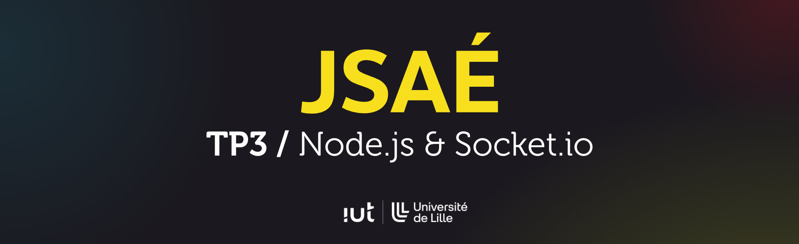
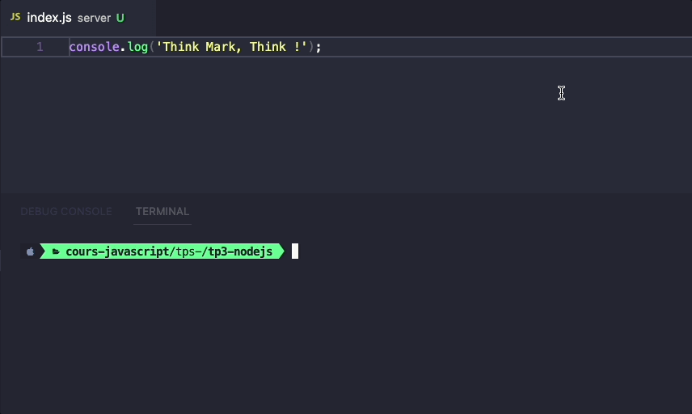
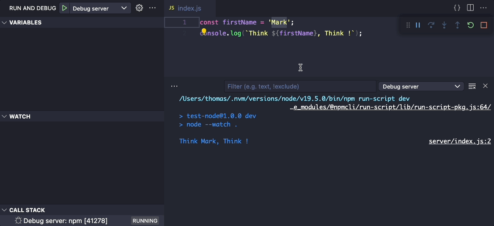
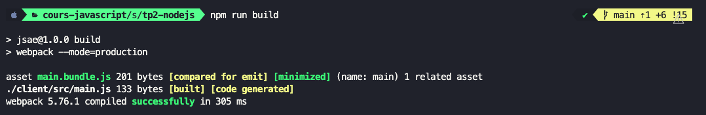
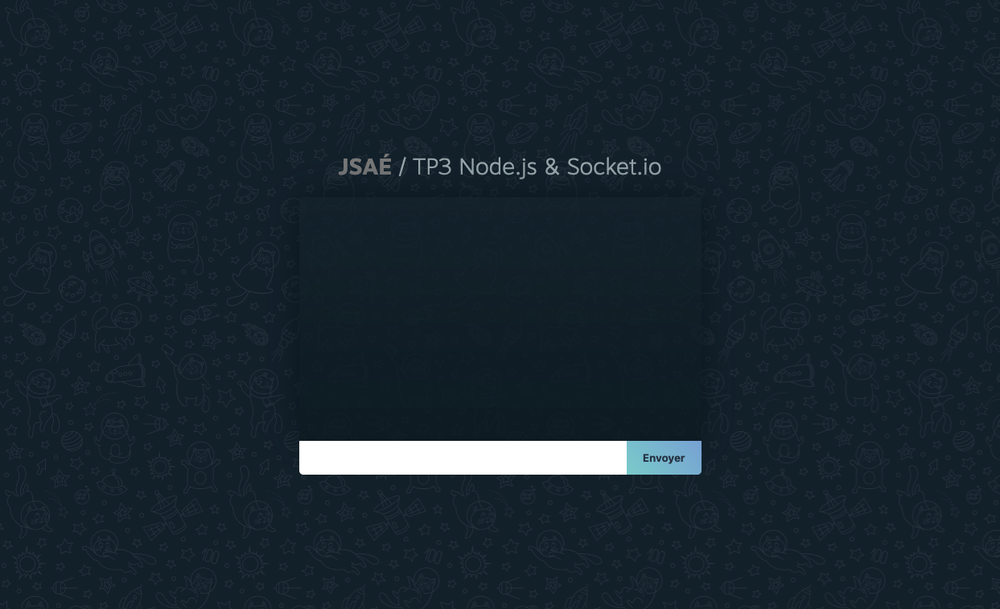

## Objectifs <!-- omit in toc -->
- Développer un serveur web avec Node.js
- Utiliser Express pour simplifier la création d'applis web back
- Développer une application fullstack avec JS côté client et serveur
- Apprendre comment installer et utiliser Socket.io

## Sommaire <!-- omit in toc -->
- [A. Préparatifs](#a-préparatifs)
- [B. Premier script Node.js](#b-premier-script-nodejs)
- [C. Debug avec Node \& VSCode](#c-debug-avec-node-vscode)
	- [C.1. Reload auto](#c1-reload-auto)
	- [C.2. Debug dans VSCode](#c2-debug-dans-vscode)
- [D. Créer un serveur web](#d-créer-un-serveur-web)
	- [D.1. Serveur de base](#d1-serveur-de-base)
	- [D.2. Express](#d2-express)
	- [D.3. Fullstack](#d3-fullstack)
- [E. Socket.io](#e-socketio)
	- [E.1. Installation](#e1-installation)
	- [E.2. Architecture](#e2-architecture)
	- [E.3. Mise en oeuvre](#e3-mise-en-oeuvre)


## A. Préparatifs

1. **Commencez par faire un fork du TP en vous rendant directement sur https://gitlab.univ-lille.fr/jsae/tp2-tests/-/forks/new**

	Pour le `namespace` choisissez de placer le fork dans votre profil utilisateur.\
	Pour `Visibility Level` sélectionnez le **mode "private"**
2. **Ajoutez votre encadrant.e de TP en tant que "reporter"** (`@patricia.everaere-caillier` ou `@thomas.fritsch`)
3. **Ouvrez le dossier du TP dans vscode.**
4. **Installez les dépendances du projet** avec `npm i`
5. ⚠️⚠️⚠️ **Contrairement aux TPs précédents, nous n'allons pas pour le moment compiler de code JS côté front**, nous ne lancerons donc pas `webpack-dev-server` (la commande `npm start`) pour nous concentrer dans un premier temps sur le code côté serveur
6. **vérifiez que votre version de Node est bien `21.*.*`** : ouvrez un terminal intégré à vscodium en tapant <kbd>CTRL</kbd>+<kbd>J</kbd> (PC) / <kbd>CMD</kbd>+<kbd>J</kbd> (Mac) et tapez :
	```bash
	node -v
	```
	Si la version affichée dans le terminal n'est pas au moins la 21, suivez les instructions du TP1 du cours de JS pour installer nvm : https://gitlab.univ-lille.fr/js/tp1/-/blob/main/A-preparatifs-linux.md#2-installation-et-configuration-de-node

7. **Récupérez et lisez le pdf du cours** sur moodle : https://moodle.univ-lille.fr/pluginfile.php/2948821/mod_resource/content/0/sae-cours-2-nodejs-socketio.pdf)

	_**En cas de question interpellez votre encadrant.e de TP !**_

## B. Premier script Node.js


**Node est un programme qui permet d'exécuter d'autres programmes développés en JS.** \
La plupart du temps, on se sert de cette possibilité pour développer des serveurs web HTTP (_à la Tomcat/Apache/Nginx/IIS_) -c'est d'ailleurs ce qu'on fera dans la suite de ce TP- mais pour le moment nous allons juste développer un petit programme à exécuter **dans un terminal**.

1. **Pour commencer, créez un dossier `/server` à la racine du TP et ajoutez y un fichier `index.js`**

	> _**NB :** cette étape n'est pas obligatoire (on pourrait mettre notre fichier js n'importe où et le nommer comme on veut) mais créer un dossier à part va nous permettre de bien séparer notre code côté back et notre futur code côté client._

2. **Dans le fichier `server/index.js` ajoutez y l'instruction :**
	```js
	console.log('Think Mark, Think !');
	```
3. **Pour lancer ce script, ouvrez un terminal intégré à VSCode et tapez-y l'instruction :**
	```js
	node server/index.js
	```
	vous devriez voir apparaître dans le terminal le texte :
	```
	Think Mark, Think !
	```
	Facile !
4. **Dans le fichier `package.json` de nos précédents TPs, on a toujours eu une clé `"main"` avec comme valeur `"index.js"`.** On ne s'en est jamais préoccupé jusque là parce qu'elle n'est utile que quand on développe avec Node, c'est donc le moment de l'utiliser :

	La clé ["main" _(doc)_](https://docs.npmjs.com/cli/v10/configuring-npm/package-json#main) permet de renseigner le point d'entrée par défaut de notre projet. L'intérêt c'est que plutôt que de lancer notre script avec la commande `node server/index.js` on pourra le lancer avec la commande `node .`. Node ira lire la clé `"main"` du `package.json` pour savoir quel script lancer.

	**Dans le fichier `package.json` modifiez donc la clé "main" comme ceci :**
	```json
	"main": "server/index.js"
	```
	Une fois le fichier sauvegardé, relancez le script cette fois avec la commande :
	```bash
	node .
	```
	Normalement le message `Think Mark, Think !` s'affiche à nouveau.
5. **Pour simplifier encore un peu le lancement du serveur, on va créer un script `npm run server` pour lancer notre appli node** : en vous appuyant sur le TP [JS / TP2 / A.Preparatifs : A.5 Créer un script de build personnalisé](https://gitlab.univ-lille.fr/js/tp2/-/blob/main/A-preparatifs.md#a5-cr%C3%A9er-un-script-de-build-personnalis%C3%A9) créez dans le fichier package.json un script `"server"` permettant de lancer la commande `node .` en tapant juste `npm run server` (https://docs.npmjs.com/cli/v10/commands/npm-run-script).

	> _**NB :** on pourrait se dire que ce qu'on vient de faire a peu d'intérêt car au final `npm run server` c'est plus "long" à taper que `node .` mais l'avantage d'avoir un "script" npm dans le `package.json` c'est qu'il devient clair pour une personne qui rejoindrait l'équipe de développement que c'est cette commande là qu'il faut lancer pour démarrer le serveur, pas besoin de "deviner" que c'est `node .`._

6. Pour bien **distinguer cette nouvelle commande "server" des précédents scripts de compilation du front**, renommez les scripts `"build"`, `"watch"` et `"start"` en `"client:build"`, `"client:watch"` et `"client:start"`.

## C. Debug avec Node & VSCode


_**Avant de passer à des exercices plus complexes, et puisqu'on était en train de travailler à la configuration de notre projet, attardons nous 5 minutes sur les outils qui vont nous permettre de débugger plus facilement notre projet.**_

### C.1. Reload auto

**Actuellement, une fois exécuté, notre programme se stoppe immédiatement. Si l'on modifie le code, il faut relancer manuellement notre serveur pour voir le résultat de nos modifications.**

Heureusement, un peu comme ce que l'on faisait avec webpack-dev-server côté front, on a la possibilité avec Node de relancer automatiquement notre application back dès qu'un fichier est modifié.

Avant la version 18 de Node.js on utilisait pour ça un outil appelé `nodemon` (https://nodemon.io/) mais aujourd'hui ce mécanisme est intégré de base dans Node.js et s'utilise avec [le flag `--watch` _(doc)_](https://nodejs.org/api/cli.html#--watch)

1. Dans le fichier `package.json` créez un script npm nommé `"server:watch"` qui lance la même commande que le `npm run server` mais avec le flag `--watch` _**ENTRE**_ `node` et le `.` :
	```
	node --watch .
	```
2. Dans le terminal intégré, lancez maintenant la commande `npm run server:watch` : Le terminal ne vous rend plus la main, et relance l'exécution à chaque fois que vous sauvegardez le fichier `server/index.js` :

	


### C.2. Debug dans VSCode

Dans les précédents TPs on avait vu que l'on pouvait débugger notre code front sans passer par les devtools du navigateur, directement dans VSCode ce qui nous avait permis de mettre des points d'arrêt directement dans VSCode, d'inspecter les valeurs de nos variables, etc.

**Et bien on peut faire exactement la même chose avec notre appli Node !**

Le principe c'est que, de la même manière qu'on laissait VSCode lancer un navigateur en mode debug pour nous, on va demander à VSCode de lancer notre appli en mode debug tout seul comme un grand.

1. Ouvrez le fichier `.vscode/launch.json` qui contient les configs de debug du front en 3 versions (Chromium, Chrome et Firefox). Pour rappel il contient normalement ceci :
	```json
	{
		// Use IntelliSense to learn about possible attributes.
		// Hover to view descriptions of existing attributes.
		// For more information, visit: https://go.microsoft.com/fwlink/?linkid=830387
		"version": "0.2.0",
		"configurations": [
			{
				"name": "Chromium Debug",
				// config pour chromium...
			},
			{
				"name": "Chrome Debug",
				// config pour chrome...
			},
			{
				"name": "Firefox Debug",
				// config pour firefox...
			},
		]
	}
	```


1. Dans la clé `"configurations"` (_au début, juste avant les trois précédentes_) ajoutez la configuration suivante :
	```json
	{
		"name": "Debug server",
		"type": "node",
		"request": "launch",
		"cwd": "${workspaceFolder}",
		"runtimeExecutable": "npm",
		"runtimeArgs": ["run-script", "server:watch"],
		"skipFiles": [
			"<node_internals>/**"
		],
	}
	```
	> _**NB :** cette configuration est basée sur l'exemple fourni dans la documentation du debug Node dans VScode et permet de lancer notre script custom "npm run dev" : https://code.visualstudio.com/docs/nodejs/nodejs-debugging#\_launch-configuration-support-for-npm-and-other-tools ._

2. **Stoppez la commande `npm run server:watch` lancée au point C.1. et lancez le debug du serveur en appuyant sur la touche <kbd>F5</kbd>**

	A partir de cet instant, VSCode va lancer lui même votre serveur en mode [`--inspect` _(doc)_](https://nodejs.org/en/docs/guides/debugging-getting-started/#enable-inspector). Vous allez donc pouvoir voir le `console.log` dans la "Debug Console" de VSCode, placer des points d'arrêt etc.

3. **Pour vérifier si le mode debug fonctionne, modifiez un peu le code de votre fichier `server/index.js` :**

	```js
	const firstName = 'Mark';
	console.log(`Think ${firstName}, Think !`);
	```

	placez un point d'arrêt sur la 2e ligne (celle du `console.log`) puis modifiez la valeur de la constante `firstName` : le programme doit se relancer automatiquement (_grâce à l'option `--watch`_) et le point d'arrêt doit s'activer (_grâce au mode debug que l'on vient de configurer_) :

	

4. **Pour finir, à l'aide de la propriété** [**`process.argv`** _(doc)_](https://nodejs.org/api/process.html#processargv) **tentez de faire en sorte que l'on puisse passer en paramètre à notre script le nom affiché dans la console.**

	L'idée c'est que plutôt que d'appeler simplement `npm run server:watch`, on puisse lancer notre serveur en ajoutant un paramètre à la fin de la commande, par exemple comme ceci : `npm run server:watch Thomas`.

	> _**Attention :** comme c'est maintenant VSCode qui lance notre serveur on n'appelle plus directement `npm run server:watch`, en revanche on peut dire à VSCode de rajouter un paramètre lorsqu'il lance notre serveur :_
	>
	> _Dans notre fichier `.vscode/launch.json`, ajoutez la valeur que vous souhaitez passer en paramètre dans la clé `"runtimeArgs"`, par exemple :_
	> ```json
	> "runtimeArgs": ["run-script", "server:watch", "Thomas"],
	> ```


## D. Créer un serveur web

**Comme expliqué dans le pdf du cours, il existe plusieurs façons de créer un serveur web. On va commencer par faire ça avec les fonctions de base de Node.js mais on utilisera ensuite Express pour simplifier le travail.**

### D.1. Serveur de base

1. **En vous servant du pdf du cours, modifiez votre fichier `server/index.js` pour lancer un serveur http** sur le port 8000 qui affiche le message "Think xxxxx, Think !" (_où `xxxxx` est le paramètre passé au lancement du serveur_) sur la page d'accueil (http://localhost:8000/).

2. **On a vu au chapitre précédent que l'on pouvait passer des valeurs à notre serveur sous la forme de paramètres envoyés dans le terminal. Une autre façon de paramétrer notre serveur est d'utiliser les variables d'environnement.**

	Pour accéder aux variables d'environnement, on utilise la [propriété `process.env` _(doc)_](https://nodejs.org/api/process.html#processenv).

	Essayez par exemple dans votre serveur de logger la variable d'environnement `PATH` ou des variables `HOME` ou `PWD`.

3. **Les variables d'environnement sont pratiques parce qu'elles vont permettre de paramétrer facilement votre application en fonction de la machine sur laquelle elle tourne.**

	Ce sera particulièrement précieux si vous déployez votre application chez un hébergeur : cela vous permettra par exemple de choisir si vous lancez votre site en http (_dev local_) ou en https (_hébergement en ligne_), le nom de domaine de l'application (_localhost en local / monsite.com en ligne_), etc.

	Pour définir une variable d'environnement uniquement dans votre session de debug, vous pouvez ajouter une clé `"env"` dans votre configuration de debug dans le fichier `.vscode/launch.json`. Par exemple pour configurer le port de votre site, ajoutez la clé `"env"` suivante dans la config de debug node dans votre `launch.json` :
	```json
	"env": {
		"PORT": "8000"
	},
	```

	> ***NB :** il est aussi possible de renseigner les variables d'environnement dans un fichier `.env` et de configurer le debug comme indiqué ici : https://code.visualstudio.com/docs/nodejs/nodejs-debugging#_load-environment-variables-from-external-file*

4. **Stoppez puis relancez votre session de debug, puis modifiez votre fichier `server/index.js` de manière à ne plus avoir de numéro de port en dur mais à le récupérer depuis la variable d'environnement `PORT`.**

	Essayez de faire en sorte d'avoir une valeur par défaut si jamais la variable `PORT` n'est pas renseignée !


### D.2. Express

_**Express est un micro-framework qui simplifie la création d'applis web avec Node.js.**_

1. Commencez par stopper votre session de debug et **installez express :**
	```bash
	npm i express
	```

2. **En vous aidant du pdf du cours, importez Express dans votre projet** et modifiez votre fichier `server/index.js` de manière à avoir le même résultat que précédemment (`Think xxxxx, Think !` affiché dans la page http://localhost:8000/)

3. À l'aide de la méthode [`app.get()` _(doc)_](https://expressjs.com/en/4x/api.html#app.get.method) et de la fonction [fs.readFileSync()](https://nodejs.org/api/fs.html#fsreadfilesyncpath-options) **développez une mini API REST qui exploite les données contenues dans le fichier `/episodes.json`** (_fourni dans ce repo_) avec 2 endpoints
	- `/api/episodes` : retourne la liste des tous les épisodes contenus dans le fichier `/episodes.json` avec pour chaque épisode uniquement leur id, leur nom et le numéro de l'épisode (ex. `"S01E02"`)
	- `/api/episodes/x` : retourne toutes les infos de l'épisode dont l'id est `"x"`

	> _**Indice :** pour des URL "variables" comme pour notre route `/api/episodes/x`, Express offre une syntaxe pratique : https://expressjs.com/en/guide/routing.html#route-parameters ._

	> _**NB :** même s'il serait possible de récupérer le contenu du fichier `episodes.json` avec une instruction import on va plutôt ici utiliser `fs.readFileSync`, et ce pour 2 raisons :_
	> 1. _D'abord **pour s'entraîner** à manipuler le système de fichiers avec Node_
	> 2. _Ensuite si on utilise `import`, le fichier `episodes.json` ne sera chargé qu'une seule fois au démarrage du serveur (quand node arrivera sur la ligne `import`) : il sera du coup impossible de mettre à jour le fichier sans stopper puis relancer le serveur._ \
	> 	_En utilisant `fs.readFileSync`, on pourrait récupérer le contenu du fichier à chaque requête (ou au bout d'un certain délai) et avoir toujours des données "fraîches"_
	>
	> _Comme indiqué dans la documentation :_ \
	> _**"If the encoding option is specified then this function returns a string. Otherwise it returns a buffer."**_ \
	> _Pour simplifier le travail, on va donc :_
	> - _demander à `readFileSync` de nous retourner le contenu du fichier json sous la forme de chaîne de caractères (les Buffers c'est un peu galère à manipuler et inutile pour des fichiers texte) en passant en deuxième paramètre à la fonction l'objet `{ encoding: 'utf8' }`_
	> - _une fois la chaîne JSON récupérée, il ne reste "plus qu'à" la parser à l'aide de `JSON.parse()`_


### D.3. Fullstack

**Le développement fullstack c'est développer une application à la fois backend et frontend.**

Comme on utilise maintenant du JS à la fois pour le back et le front, c'est du coup beaucoup plus facile de faire du dev fullstack !

Le code **backend** s'exécute dans **Node.js**, côté serveur.
Le code **frontend** s'exécute (_après compilation par Babel et Webpack_) dans le **navigateur** des personnes qui visitent le site, côté client.

1. **Observez le contenu du dossier `/client` :**

	il contient un dossier `/client/src/` qui contient une solution du TP2 sur les tests (_appli de chat_), et un dossier `/client/public` qui contient plusieurs fichiers statiques (_html, css, images, etc._) mais les deux ne sont pas encore connectés.

2. En vous aidant du middleware [`express.static` _(doc)_](http://expressjs.com/en/4x/api.html#express.static) et de l'exemple contenu dans le pdf du cours, **faites en sorte que votre serveur express retourne les fichiers contenus dans le dossier `client/public`** :

	Par exemple, si on visite http://localhost:8000/, on doit voir le fichier `/client/public/index.html`. Si on se rend sur http://localhost:8000/css/main.css on doit voir le contenu du fichier `client/public/css/main.css`, etc.

	> _**NB :** attention, le chemin que l'on passe à express.static est relatif au dossier dans lequel vous lancez le serveur c'est à dire la racine du TP : pas besoin ici de rajouter `../` devant le dossier `client/public`_


3. Le fichier `client/src/main.js` est un fichier source que l'on va avoir besoin de compiler avec Babel et Webpack. **Modifiez les clés entry et output du fichier `webpack.config.js`** pour compiler le fichier `client/src/main.js` dans le fichier `client/public/build/main.bundle.js`.

	**Une fois la config modifiée, lancez la compilation du code client dans un terminal intégré à VSCode :**

	```bash
	npm run client:build
	```

	la compilation doit fonctionner et générer le fichier `client/public/build/main.bundle.js` :

	

4. **Maintenant que le fichier compilé est généré, il ne reste plus qu'à l'inclure dans la page `client/public/index.html` :** ajoutez une balise `<script>` qui pointe vers `/build/main.bundle.js`.

	Ouvrez dans votre navigateur la page http://localhost:8000, vous devez en principe voir un prompt vous demander un nom d'utilisateur puis l'interface du chat s'afficher :

	


5. **On commence à avoir une base à peu prêt opérationnelle pour coder notre première appli fullstack mais il nous manque encore quelque chose pour être efficaces : le live-reload avec webpack-dev-server.**

	Dans les précédents TPs on lançait `webpack-dev-server` avec le script `npm start` (_renommé en `npm run client:start` à l'étape [B. Premier script Node.js](#b-premier-script-nodejs)_) qui lançait la commande `webpack serve --mode=development` (_script configuré lors du [TP3 / C.6. Webpack : Live reload](https://gitlab.univ-lille.fr/js/tp3/-/blob/main/C-modules.md#c6-webpack-live-reload)_).

	On pourrait (au prix de quelques adaptations) continuer d'utiliser cette méthode mais on aurait alors au final 2 serveurs à lancer : notre serveur node à nous (`server/index.js`) et le serveur de développement de `webpack-dev-server`, ce qui n'est pas hyper optimal.

	Pour faire court, il est possible d'intégrer webpack-dev-server directement dans notre propre serveur afin qu'il soit capable non seulement de servir notre appli express mais aussi de compiler à la volée le code client.

	Commencez par installer les 2 paquets suivants :
	```bash
	npm i -D webpack-dev-middleware webpack-hot-middleware
	```

	Puis créez un fichier `server/middlewares/addWebpackMiddleware.js` avec le code suivant :
	```js
	import webpack from 'webpack';
	import webpackDevMiddleware from 'webpack-dev-middleware';
	import webpackHotMiddleware from 'webpack-hot-middleware';
	import webpackConfig from '../../webpack.config.js';

	export default function addWebpackMiddleware(app) {
		const webpackConfigForMiddleware = {
			...webpackConfig,
			mode: 'development', // on force le mode development
			plugins: [new webpack.HotModuleReplacementPlugin()], // on ajoute le plugin Hot
		};
		if (typeof webpackConfigForMiddleware.entry === 'string') {
			webpackConfigForMiddleware.entry = [
				'webpack-hot-middleware/client?reload=true', // ajout du script permettant le reload
				webpackConfigForMiddleware.entry, // notre fichier client/src/main.js
			];
		}
		const compiler = webpack(webpackConfigForMiddleware);
		// activation des 2 middlewares nécessaires au live-reload :
		app.use(
			webpackDevMiddleware(compiler, {
				publicPath: webpackConfig.output?.publicPath,
			})
		);
		app.use(webpackHotMiddleware(compiler));
	}
	```
	Enfin, dans votre fichier `server/index.js` appelez la fonction `addWebpackMiddleware` que l'on vient de créer (_avant tout appel à `app.use()` ou `app.get()`_) :
	```js
	addWebpackMiddleware(app);
	```

	**Voilà, c'était un peu laborieux mais maintenant votre serveur Node est capable de recompiler lui-même le code JS du front et de recharger le navigateur dès que vous modifiez un fichier du front.** Ça devrait en principe vous permettre de gagner beaucoup de temps sur la suite !

## E. Socket.io


_**Après tous ces préparatifs, nous arrivons enfin au gros morceau de ce TP : Socket.io**_

Comme expliqué dans le pdf du cours, Socket.io est une bibliothèque qui va simplifier la mise en place d'applications basées sur les websocket (_applications temps réel et communications bidirectionnelles client ⭤ serveur, du genre tableau blanc, chat, jeu en ligne, etc._)

### E.1. Installation

1. **Commencez par installer socket.io dans le TP :**
	```bash
	npm i socket.io socket.io-client
	```
2. **Créez un serveur websocket avec socket.io dans `server/index.js` :**
	```js
	import { Server as IOServer } from 'socket.io';

	const io = new IOServer(httpServer);
	io.on('connection', socket => {
		console.log(`Nouvelle connexion du client ${socket.id}`);
	});
	```
3. **Dans le fichier `client/src/main.js` connectez le front au serveur websocket avec le code suivant :**
	```js
	import { io } from 'socket.io-client';
	const socket = io();
	```

	Ce code suffit à connecter le client au serveur socket.io ! Ouvrez plusieurs onglets de votre navigateur sur http://localhost:8000 et regardez dans la Debug Console de VSCode : vous devez en principe voir passer des messages `"Nouvelle connexion du client xxxxxxx"` !

4. **Vous pouvez détecter la déconnexion d'un client en modifiant le code comme ceci :**
	```js
	io.on('connection', socket => {
		console.log(`Nouvelle connexion du client ${socket.id}`);

		socket.on('disconnect', () => {
			console.log(`Déconnexion du client ${socket.id}`);
		})
	});
	```
	Ouvrez et fermez des onglets sur votre site, les messages de connexion/déconnexion doivent s'afficher.

### E.2. Architecture
**Maintenant que socket.io est en place, vous allez pouvoir commencer à modifier le chat pour faire en sorte qu'on puisse échanger des messages via socket.io et plus via le `BroadcastChannel` ! Mais avant ça posons nous 2 secondes sur l'architecture de notre application.**

Techniquement, on pourrait pour cet exercice se contenter de remplacer les appels aux méthodes de `BroadcastChannel` par des appels aux méthodes de socket.io. L'inconvénient c'est qu'on se retrouverait alors avec les mêmes limites qu'on avait jusque là : impossible de récupérer l'historique lorsqu'on se connecte, risque d'incohérence entre la liste des messages affichés dans 2 fenêtres différentes si problème réseau, etc.

Ce que l'on vous propose ici c'est plutôt de **migrer toute la partie "métier" de l'application (le `"ChatRepository"`) côté serveur** ! Avec cette technique c'est le serveur qui va **"centraliser"** la logique métier (_l'historique des messages_) et servir de **"source d'information unique"** (_["Single source of truth"](https://en.wikipedia.org/wiki/Single_source_of_truth)_) pour tous les clients connectés.

1. **Commencez par déplacer les fichiers `client/src/ChatRepository.js` et `client/src/ChatRepository.test.js` dans le dossier `/server/`.**

	Lancez dans un terminal de VSCode la commande :

	```
	npm run test:watch
	```

	⚠️ **Cette commande devra rester lancée pendant toute la suite du TP !** Gardez bien un oeil dessus en permanence ! 👀 ⚠️ Il est probable que vous ayez à modifier le ChatRepository et donc les tests dans la suite du TP.

2. **Dans le code côté client, supprimez l'import et tous les appels à ChatRepository.**

	_**NB :** En principe votre appli ne fonctionne plus mais ne plante pas !_

3. **Dans `server/index.js` instanciez le ChatRepository comme vous le faisiez précédemment côté client.**


### E.3. Mise en oeuvre
**Maintenant que les choses sont bien rangées, vous allez pouvoir coder votre serveur websocket.**

Avec socket.io, on dispose de plusieurs méthodes pour envoyer des messages du client vers le serveur ou du serveur vers les clients :

**côté client on peut utiliser :**
- [socket.on](https://socket.io/docs/v4/client-api/#socketoneventname-callback) pour **recevoir** des messages depuis le serveur
- [socket.emit](https://socket.io/docs/v4/client-api/#socketemiteventname-args) pour **envoyer** des messages au serveur

**côté serveur on utilise :**
- [io.on](https://socket.io/docs/v4/server-api/#serveroneventname-listener) pour détecter les **nouvelles connexions**
- [io.emit](https://socket.io/docs/v4/server-api/#serveremiteventname-args) pour **envoyer** un message à **tous les clients connectés** (broadcast)
- [socket.on](https://socket.io/docs/v4/server-api/#socketoneventname-callback) pour **recevoir** les messages envoyés **par un client** en particulier
- [socket.emit](https://socket.io/docs/v4/server-api/#socketemiteventname-args) pour **envoyer** un message **à un client** en particulier

**À l'aide de ces différentes méthodes, modifiez le mini chat pour faire en sorte qu'on puisse échanger des messages via socket.io et plus via le `BroadcastChannel` :**

1. si on tape un message dans le champ de saisie et qu'on soumet le formulaire, le message est envoyé à tous les autres clients connectés
2. quand un client envoie un message, il s'affiche dans l'historique des messages de tous les clients connectés
3. quand un nouveau client se connecte, il récupère l'ensemble de l'historique des messages

Comme précédemment les messages envoyés par le client lui-même apparaissent différemment de ceux des autres clients.

> _**NB :** si vous voulez suivre la consommation mémoire et cpu de votre application, je vous conseille d'installer [express-status-monitor (npm)](https://www.npmjs.com/package/express-status-monitor)_
>
> 
>
> _Pour l'utiliser, après l'avoir installé avec npm, ajoutez le code suivant à votre fichier `server/index.js` :_
> ```js
> import expressStatusMonitor from 'express-status-monitor';
> // permet d'avoir une page http://localhost/status pour suivre la consommation mémoire/cpu/etc.
> app.use(expressStatusMonitor({ websocket: io }));
> ```
> _puis modifiez la création du serveur socket.io :_
> ```js
> const io = new IOServer(httpServer, {
>	// pour permettre à express-status-monitor de fonctionner
>	// cf. https://github.com/RafalWilinski/express-status-monitor/issues/181#issuecomment-1086649762
>	allowEIO3: true,
> });
> ```
